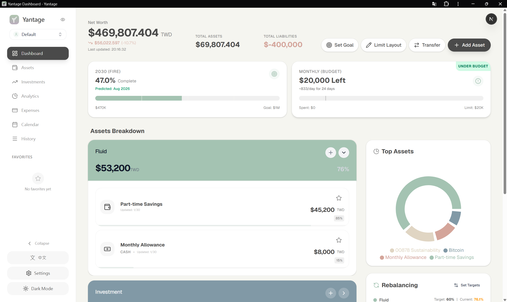
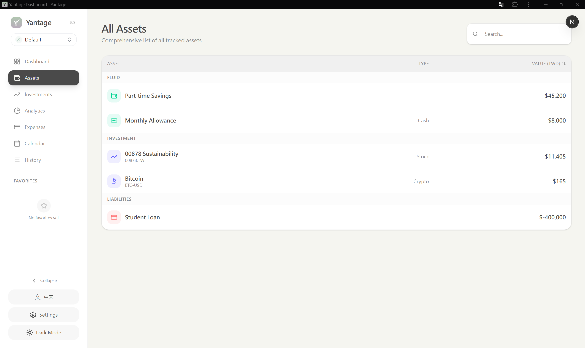
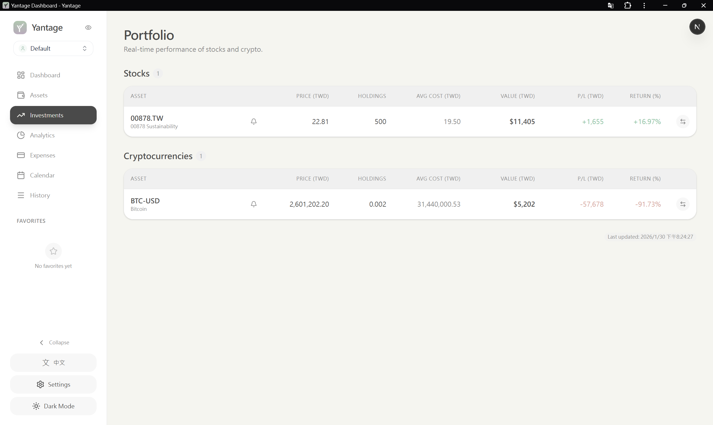
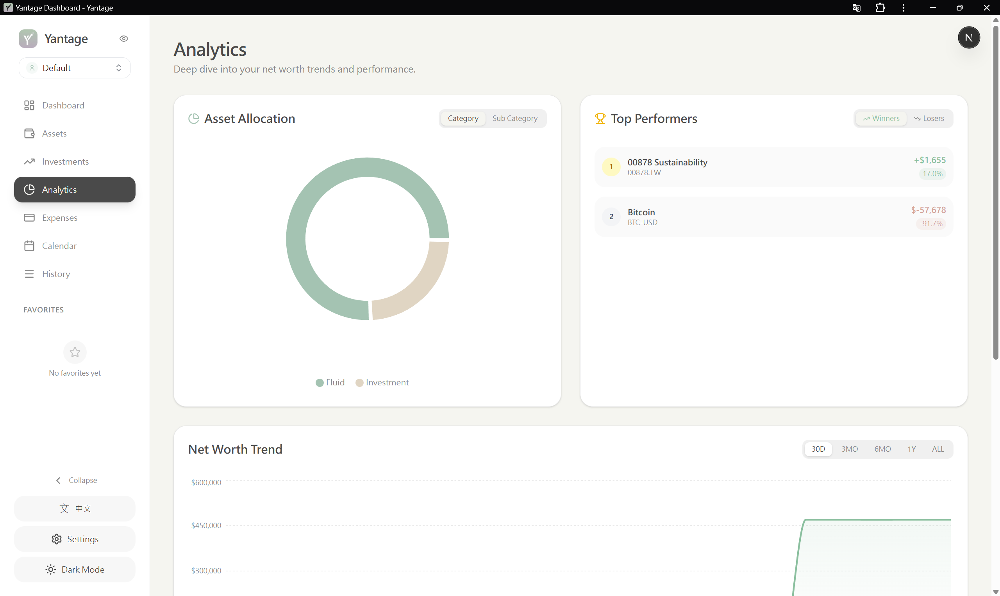
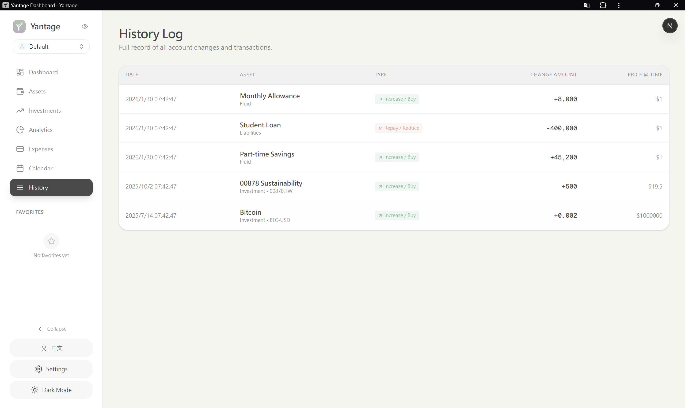
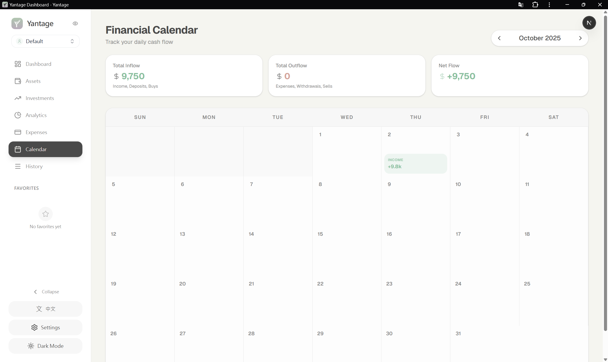
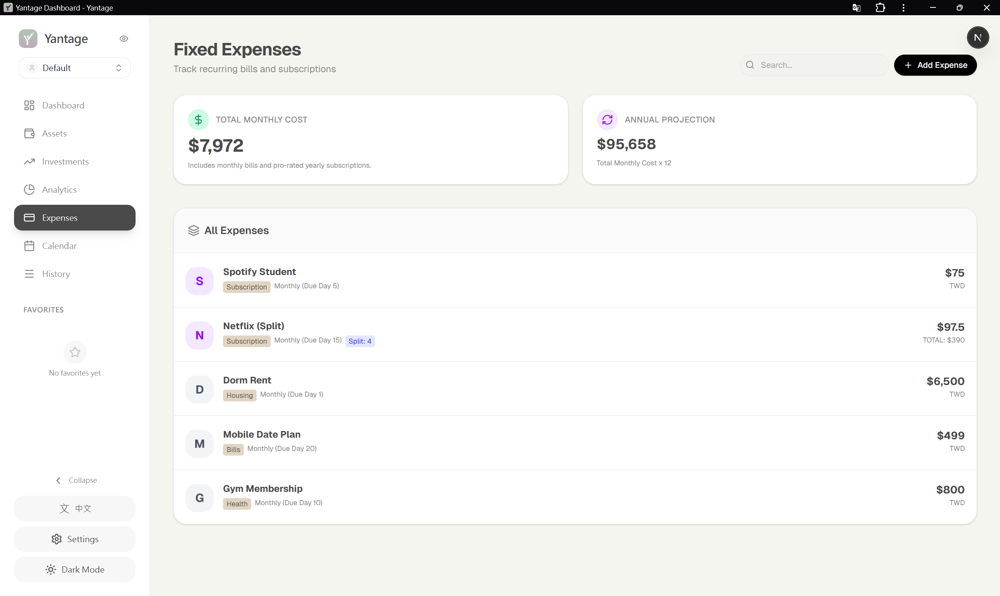
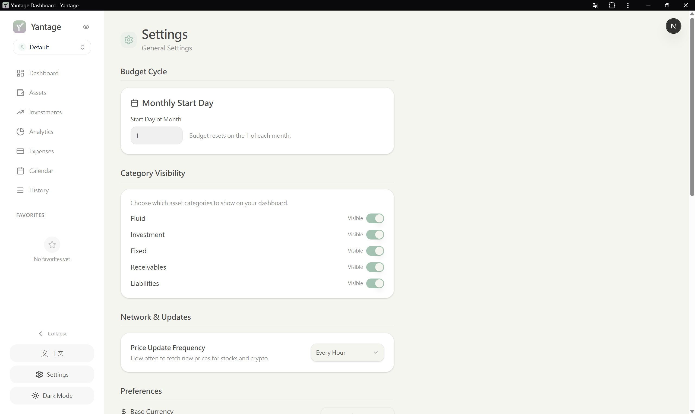
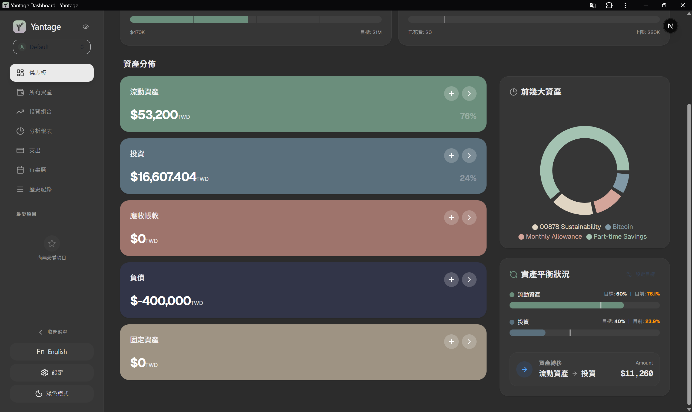

# Yantage 💰 - 個人資產儀表板

**Yantage** 是一款注重隱私的個人財務管理工具，旨在幫助您追蹤淨資產、管理多類別資產，並實現財務自由。採用「模糊記帳」理念，專注於高階資產追蹤，無需記錄每一筆交易的繁瑣負擔。


> [English Version](README.md) | 繁體中文版

---

## 💡 專案靈感

本專案的靈感來自 [Percento](https://www.percento.app/cn/)，一款設計精美的個人理財應用程式。雖然 Percento 提供了出色的使用體驗，但我想打造一個符合以下需求的工具：
- **隱私優先**：100% 本地資料儲存，無雲端依賴
- **符合個人需求**：功能完全依照我的理財管理習慣量身打造
- **支援台灣市場**：原生整合台股市場與 MAX 交易所
- **保持開源**：讓所有人都能免費使用、修改與學習

這是一個為了解決我自己的財務追蹤挑戰而誕生的熱情專案，希望也能幫助到其他人！

---

## 📸 應用程式截圖

### 儀表板


### 資產管理


### 投資追蹤


### 數據分析


### 交易紀錄


### 財務日曆


### 支出追蹤


### 設定與工具


### 深色模式（繁體中文）


---

## ✨ 功能特色

### 📊 **全方位資產管理**
- **多類別追蹤**：管理 5 大類資產（流動資產、投資、固定資產、應收帳款、負債）
- **即時估值**：自動抓取股票價格（台股/美股透過 Yahoo Finance）與加密貨幣（透過 CCXT/MAX）
- **MAX 交易所整合**：使用唯讀 API 自動同步餘額與交易紀錄

### 🎯 **財務規劃工具**
- **財富模擬器**：根據投入金額與預期報酬率預測未來財富
- **緊急預備金檢測**：根據流動資產計算財務生存時間
- **目標追蹤**：設定並監控 FIRE（財務獨立，提早退休）目標
- **預算管理**：視覺化追蹤每月預算進度

### 📈 **分析與洞察**
- **淨值趨勢**：歷史追蹤與互動式圖表
- **資產配置**：視覺化投資組合分布
- **再平衡建議**：維持目標資產配置
- **績效排行**：追蹤表現最佳/最差的資產

### 🔒 **隱私優先**
- **100% 本地儲存**：所有資料儲存於本地 SQLite 資料庫
- **無雲端同步**：您的財務資料永不離開您的電腦
- **安全的 API 金鑰**：加密儲存於本地資料庫

---

## 🚀 快速開始

### 系統需求
- **Python 3.8+**（後端）
- **Node.js 18+**（前端）

### 安裝步驟

1. **複製專案**
   ```bash
   git clone https://github.com/YuunJiee/Personal-Asset-Dash.git
   cd Personal-Asset-Dash
   ```

2. **執行啟動腳本**
   ```bash
   ./start.sh
   ```
   此腳本會自動：
   - 建立 Python 虛擬環境（或使用 Conda）
   - 安裝後端依賴套件
   - 安裝前端依賴套件
   - 同時啟動前後端伺服器

3. **訪問應用程式**
   - **前端介面**：http://localhost:3000
   - **API 文件**：http://localhost:8000/docs

---

## 🛠️ 技術架構

### 前端
- **框架**：Next.js 15（App Router）
- **UI**：Shadcn/UI + TailwindCSS
- **圖表**：Recharts
- **狀態管理**：React Server Components + Client Hooks
- **國際化**：自訂字典式翻譯（英文/繁體中文）

### 後端
- **框架**：FastAPI
- **資料庫**：SQLite + SQLAlchemy ORM
- **排程器**：APScheduler（背景價格更新）
- **服務**：
  - `MAXService`：交易所整合（HMAC 驗證）
  - `MarketService`：即時價格抓取

---

## 📁 專案結構

```
personal-asset-dash/
├── backend/              # FastAPI 後端
│   ├── routers/          # API 端點
│   ├── services/         # 業務邏輯
│   ├── models.py         # SQLAlchemy 模型
│   ├── schemas.py        # Pydantic 驗證
│   └── README.md         # 後端文件
├── frontend/             # Next.js 前端
│   ├── app/              # App Router 頁面
│   ├── components/       # React 元件
│   ├── src/i18n/         # 翻譯檔案
│   └── README.md         # 前端文件
├── .gitignore            # Git 忽略規則
└── start.sh              # 啟動腳本
```

---

## 🔑 設定說明

### 後端設定
1. 進入設定頁面
2. 設定 MAX 交易所 API（選用）：
   - 輸入 API Key
   - 輸入 API Secret
   - 點擊「同步 MAX 資產」

### 環境變數
參考 `.env.example` 查看可用的設定選項。

---

## 📖 文件

- **後端 API**：參見 [backend/README.md](backend/README.md)
- **前端元件**：參見 [frontend/README.md](frontend/README.md)
- **API 參考**：http://localhost:8000/docs（執行時）

---

## 🌍 語言支援

應用程式支援以下語言：
- 🇺🇸 English
- 🇹🇼 繁體中文

可在設定頁面切換語言。

---

## 🤝 貢獻

歡迎貢獻！請隨時提交 Pull Request。

---

## 📝 授權

MIT License - 詳見 LICENSE 檔案。

---

## ⚠️ 免責聲明

此工具僅供個人財務追蹤使用，不提供財務建議。在做出任何投資決策前，請務必諮詢合格的財務顧問。

---

## 🙏 致謝

- 使用 [Next.js](https://nextjs.org/) 建構
- 由 [FastAPI](https://fastapi.tiangolo.com/) 驅動
- UI 元件來自 [Shadcn/UI](https://ui.shadcn.com/)
- 開發過程中使用 AI 程式設計輔助工具協作

---

## 📞 聯絡方式

如有問題或建議，歡迎開 Issue 或 Pull Request！
